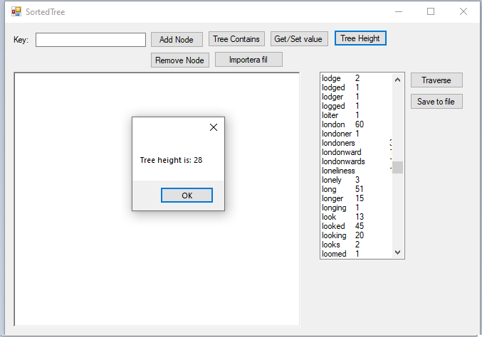

# Binary Searchtree

This was written in the course Algorithms and Softwaredesign.
The task was to implement a binary searchtree that would be able to handle tree nodes, count (traverse) and count each node and also take account into node value.

The assignment was dealed out with the ITree interface already in place and the task was to implement all interface functions by yourself.

The program also needed to import files and traverse the counts for that file. 
See screenshots below!

**Start screen**

**Contains**

**Get/Set**

**Height**

**Traverse**

**Save**

**Import file**

**After import (36.txt)**

Credits go out to: Hans-Edy Mårtensson (Teacher & ITree interface coder) and Rod Stephans (Author of the program example - from the book Essential Algorithms).

I must warn that this script is not the best example of following standard naming conventions but I will blame it on being a student and not knowing better :-)

# Remember

  - This was a school assignment during my time studying IT-Security and Software testing - this is not guaranteed to work 100%.
  - Do not copy and use this in your school assignments, instead learn from it and improve it.
  - This will not be maintained by me, this is uploaded for safekeeping online.

License
----

MIT

**Free Software, Hell Yeah!**
